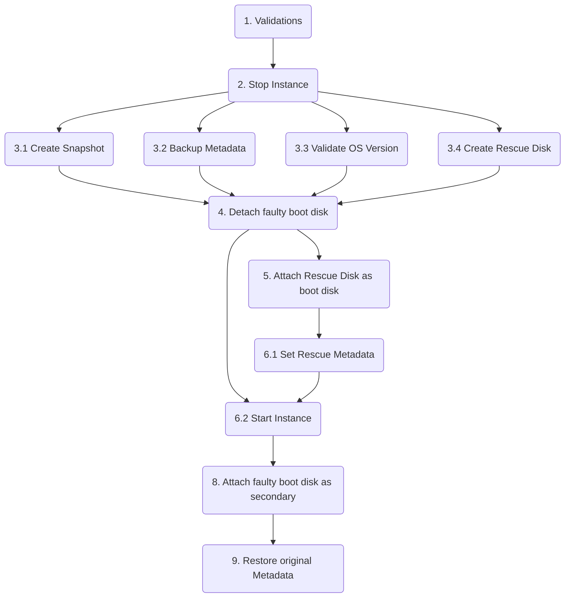

# README GCE Rescue Mode 
Authors:
- halleysouza@google.com
- runxin@google.com

## This project aim to make easy to boot instances in rescue mode.

# Events flow.

# Events description.

## 1. Validations.
This first step validate if the user has enough IAM permissions to perform all actions necessary to config the instance in rescue mode.
Also, at this initial phase is also validate if the instance isn't already configured as rescue mode. This is done by checking if the custome metadata key "rescue-mode" exist with the timestamp as value.

## 2. Stop Instance.
Simple try to stop the instance, if running to continue the necessary steps.

### Note: Steps 3.X runs concurrently.

## 3.1 Create Snapshot.
Before continue with any modification a snapshot from the faulty boot disk will be taken, to guarantee that any modification made on the OS level can be rolled back.

## 3.2 Backup Metadata.
This script rely on modifying some custom metadata, such as startup-script and adding a key called `rescue-mode` to identify this instance is configured as rescue mode. The value of the key `rescue-mode` should be the timestamp, same used for creating the rescue disk and the snapshot.
Given the limit of 256kb for custom metadata, this script will replace all existing metadata, to be sure that will be enough to configure our startup-script.

## 3.3 Validate OS version.
At this step we will try to validate what version of the operation system is being used. This will influence what OS will be used as rescue mode. This is due the fact that, when using the same image, the instance may have conflicts with the partitions having the same UUID.

## 4. Detach faulty disk.
Here we already identified the disk source and the deviceName and will detach from the instance, to attach later as secondary disk.

## 5. Attach Rescue Disk as boot disk.
The recently created disk (3.1) will be attached here as boot disk.

## 6. Set Rescue Metadata.
As mentioned on the Backup Metadata (3.2) all existing custom metadata will be replaced by our startup-script. This is meant to be run at the first boot of the instance. The script will identify the faulty disk, as the correct partition, and mount on /mnt/sysimage.

## 7. Start Instance.
Start the instance with the rescue boot disk for the first time. This will run the startup-script that will be waiting for the faulty disk to be attached.

## 8. Attach Faulty boot disk as secondary.
Once the instance is running the faulty boot disk will be attached as secondary. This steps is done with the instance already up to avoid boot issues, such as we can find with partitions with the same UUID or when you are trying to rescue a Windows instance.

## 9. Restore Original Metadata.
Finally, at the end this script will restore the original custom metadata that existed on the instance before step 6. Good to keep in mind that the key "rescue-mode" will keep existing, until the script restore the instance to the original configuration.